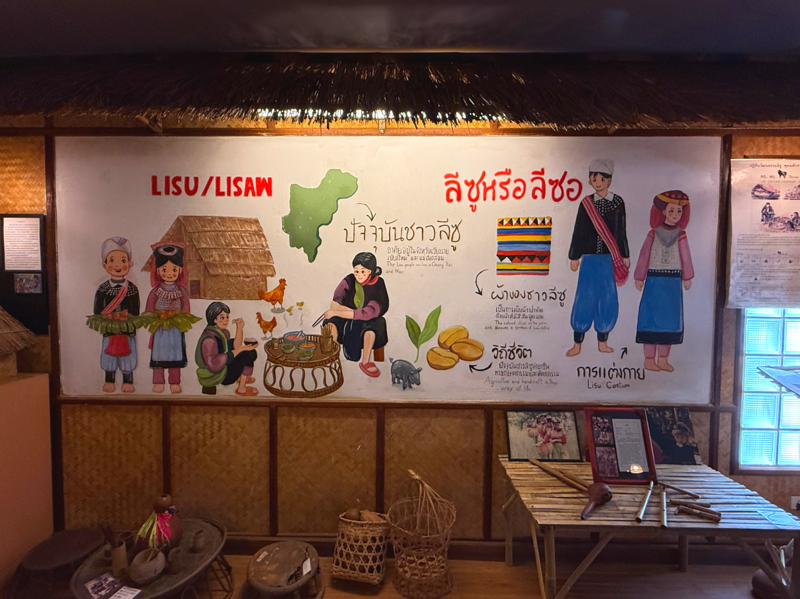
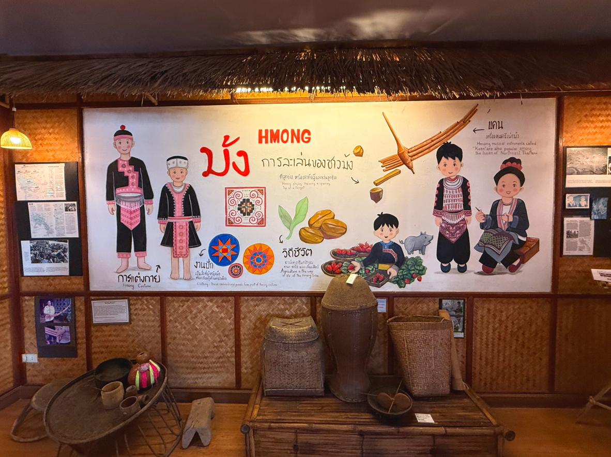
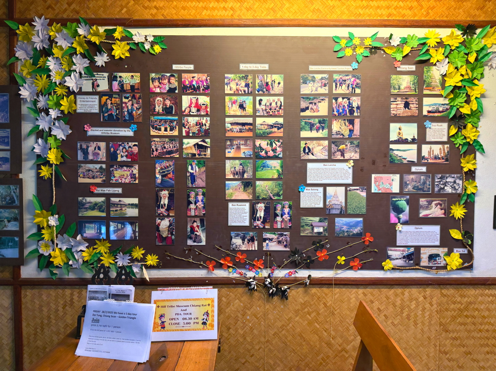
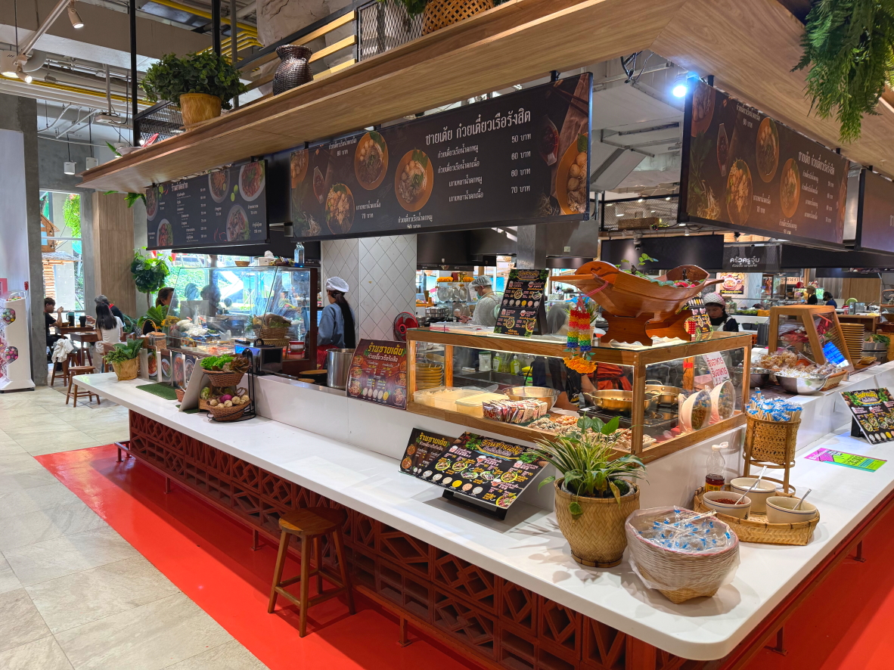

# 20250227_chiangrai

<html>
<head>

<meta charset="UTF-8">
<meta http-equiv="Content-Type" content="text/html; charset=UTF-8">
<meta http-equiv="X-UA-Compatible" content="IE=EmulateIE10" />
<meta http-equiv="X-UA-Compatible" content="IE=edge">

<meta name="viewport" content="width=device-width, initial-scale=1.0">

<!--ここから上はお決まりの定型文です-->

<!--ここからが表現の書式などを決めるcssという部分-->

<link href="https://cdnjs.cloudflare.com/ajax/libs/lightbox2/2.7.1/css/lightbox.css" rel="stylesheet">

</head>

<body>

モバイル端末をお使いの場合は、画面を横向きにすると
より見やすくご覧頂けます。

<!--ここ上は、ほぼそのまま使います！-->

<!--QRコードの挿入例-->

 アクセス用QRコード

<marquee direction="left" scrollamount="20" width="30%">(^_^)/~alis</marquee>

<!--流れ文字の挿入例-->
<h1><marquee behavior="left">!!! 2025/02/27、チェンライの街で山岳民族資料館を見学!!!</marquee></h1>

                          

<!--ここから下が、本体部分-->

<h2>四日ぶりの朝焼け 朝6:55</h2>

    
<h2>今日2月27日は義母の100日法要、日本の49日に相当するものです 画像クリックで100日法要のページにと飛びます</h2>

<h2>法要がひと段落したのでお花でもみに行きます</h2>

    
<h2>下り線の工事区間では上り線側も工事がスタートしてました</h2>

<h2>向かった先はこちら↓GoogleMapsが埋め込まれています</h2>
<iframe src="https://www.google.com/maps/embed?pb=!4v1740664356400!6m8!1m7!1sC-s2nYRrjdcBKe7ccZic7Q!2m2!1d19.90851894232863!2d99.83521068367651!3f260.5156248286657!4f12.27001027210315!5f0.4000000000000002" width="600" height="450" style="border:0;" allowfullscreen="" loading="lazy" referrerpolicy="no-referrer-when-downgrade"></iframe> 
    
<h2>お花売りのお姉様が信号の合間に車の周りをうろうろ</h2>

    
<h2>無事到着しましたが、なんと閉鎖！？</h2>

    
<h2>閉鎖直後だったので、お花が残ってました</h2>

    
<h2>近くに山岳民族資料館があったのでそちらを見学 ↓GoogleMapsが埋め込まれています</h2>
<iframe src="https://www.google.com/maps/embed?pb=!4v1740664698153!6m8!1m7!1s7gL9eS5ddLXPc6G6sHyheQ!2m2!1d19.90896834849856!2d99.83568851781078!3f11.265183089610971!4f6.019390257861019!5f0.7820865974627469" width="600" height="450" style="border:0;" allowfullscreen="" loading="lazy" referrerpolicy="no-referrer-when-downgrade"></iframe> 
    
<h2>1人50バーツでスライドショーの資料紹介と、山岳民族たちの資料閲覧です</h2>

    
<h2>エレベータで3階まで上がったところです</h2>

    
<h2>タイ北部に95万人いるとのこと</h2>

    
<h2>部族毎に衣装が違っていて、部族間交流もあるらしい</h2>

    
<h2>1000m以上の高地に住み、定期的に移動して焼畑でケシの栽培などしていたらしいです 現在は政府の定住化政策に基づき、低値で農作物などの栽培をしているとのこと</h2>

    
<h2>2010年時点の調査で、ごく一部の部族たちの紹介がされてました</h2>

    
<h2>主に布製品のお土産物</h2>

    
<h2>民族衣装の若者たちは、笑顔が晴れやか！</h2>

    
<h2>明日バンコクに移動するので、チェンライの街を散策</h2>

    
<h2>霊柩車は無いので、棺はトラックで運びます</h2>

    
<h2>ショッピングモールのフードコートでお昼をいただきますが、ここもしばらく見納め</h2>

    
<h2>肉まんらしき物をいただきますが、味は全然違います</h2>

    
<h2>スーパーで働くロボット君と２ショット</h2>

    
<h2>ロボット君の動画↓画像クリックで動画再生します</h2>

<h2>人間の店員さんはスマホいじりで多忙中</h2>

    
<h2>BYDのディーラーは中国色を押し出してました</h2>

    
<h2>大陸平野部の川はどろんこ色で何がいるか分かりません</h2>

    
<h2>メーチャンLotusの髪型がボーイッシュな警備のお姉さんもしばし見納め</h2>

    
<h2>このグラデーションともしばしのお別れ</h2>

  

    
  
<h2>今日のBGMは 日本の愛の歌</h2>
<iframe width="560" height="315" src="https://www.youtube.com/embed/BjwaDYU-rO0?si=ihFu3IIV1D4KIRUd" title="YouTube video player" frameborder="0" allow="accelerometer; autoplay; clipboard-write; encrypted-media; gyroscope; picture-in-picture; web-share" referrerpolicy="strict-origin-when-cross-origin" allowfullscreen></iframe> 
    
<!--
  
<h2>メタバース「cluster」内のイベントで「雪の約束」by まいてゃさん ダンサーの玖遠さんがトラブってみんなでステージダンスになりました</h2>
  
        <h2>MP4ファイルの再生</h2>
    <video controls width="640">
        <source src="2025-02-26 yukinoyakusoku by maitiya.mp4" type="video/mp4">
        お使いのブラウザは video タグをサポートしていません。
    </video>
-->

<!--
  
<h2>もう一つ まいてゃさんアルバム MBG 2502 10kyoku 再掲です</h2>
<iframe width="560" height="315" src="https://www.youtube.com/embed/xVTSe-eXbFs?si=1YAnLelZqsU-zs0m" title="YouTube video player" frameborder="0" allow="accelerometer; autoplay; clipboard-write; encrypted-media; gyroscope; picture-in-picture; web-share" referrerpolicy="strict-origin-when-cross-origin" allowfullscreen></iframe> 
-->
    
<!--
  
<h2>スティーブ・ジョブズの伝説の講義</h2> 
<iframe width="560" height="315" src="https://www.youtube.com/embed/XsRpvWHIVw0?si=f7IA0pv9iZWVk3VH" title="YouTube video player" frameborder="0" allow="accelerometer; autoplay; clipboard-write; encrypted-media; gyroscope; picture-in-picture; web-share" referrerpolicy="strict-origin-when-cross-origin" allowfullscreen></iframe>    
    
    
<h2>スティーブ・ジョブズ氏の講義の内容が「笑って死ぬ」by まいてゃ さんの歌の内容と大筋で同じに聞こえます 以下に再掲しますね</h2>

    
<h3>歌の後半部分しか撮れてませんが、2月16日のイベントで公開された「笑って死ぬ」 by まいてゃ 白ドレスはダンサーの玖遠さん、黒いドレスがまいてゃさん</h3>
<iframe width="560" height="315" src="https://www.youtube.com/embed/s4ZcbxAluMM?si=Xa32xo19UCNaWv0v" title="YouTube video player" frameborder="0" allow="accelerometer; autoplay; clipboard-write; encrypted-media; gyroscope; picture-in-picture; web-share" referrerpolicy="strict-origin-when-cross-origin" allowfullscreen></iframe> 
-->
    

    <h3>お気に入りの「笑って死ぬ」 by まいてゃさんも再々掲です</h3>
<h2><a href="https://torokoid.github.io/20250221_chiangrai/maitiya3.mp3" target="_blank">この文字クリックで再生します 下の再生ボタンで同じ曲をループ再生します</a></h2>

    <audio controls loop>
        <source src="https://torokoid.github.io/20250221_chiangrai/maitiya3.mp3" type="audio/mpeg">
        お使いのブラウザは audio タグをサポートしていません。
    </audio>
  

   
<h2>以上、チェンライの街で山岳民族資料館を見学、最後は夕焼けグラデーションでした。 ここまでご覧いただきありがとうございました。</h2>

     
<h2>
<a href="https://torokoid.github.io/20241126_chiangrai/" target="_blank">Back to the menu page</a>
</h2>

   

         

  

      

<!--本体はここまで-->

<!--画面に空白地帯を作って、背景が見えるようにしています-->
                                              

<!-- フッタ -->
<footer>

Copyright 2025/02/28 alis @ChiangRai

</footer>

<!--HPにさまざまなJavaScriptを呼び込むための書式-->

    
    </body>
    
</html>
